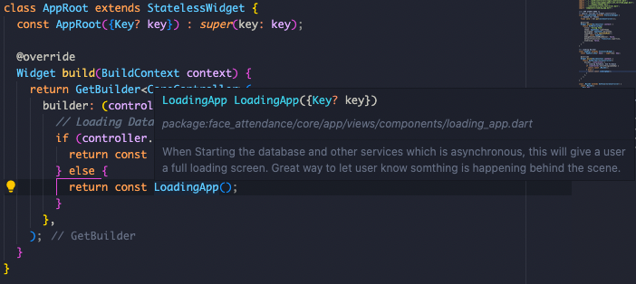
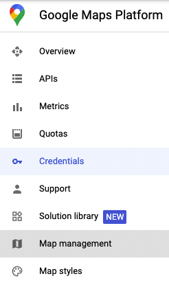
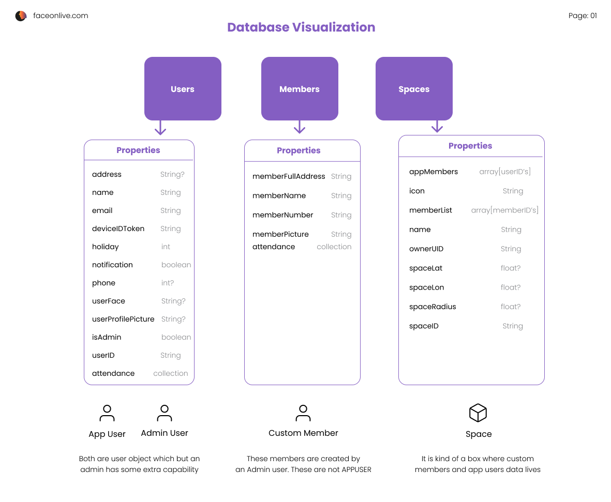
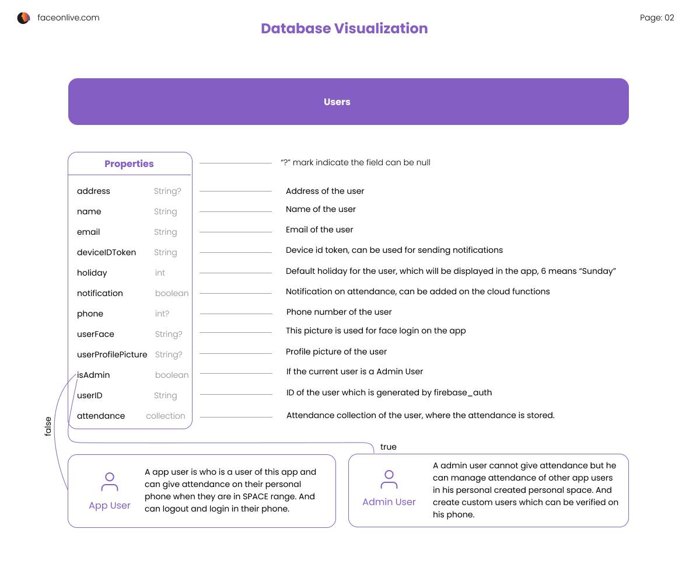
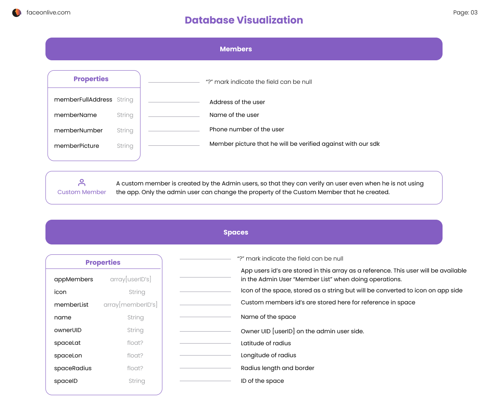

# Face Attendance

An App Made with Face SDK


https://user-images.githubusercontent.com/91896009/164498733-955df7c1-71d6-42e4-8cdc-7e6b7e30e460.mp4


## Before we get started
- 👉  For now, Our app does support only Android platform (arm64).

- 👉  You will need a new AAR Library if you are creating this app on your own or changing the package name.

- 🚀 If you are looking the code in a code editor.You can hover over it to see the info of a particular function or classes. 👇

- 🙋🏽‍♂️ We are improving the codebase and trying to make it better,but you may see some legacy codes. 🔥


- It would be super awesome 😍  if you install flutter and dart extension on your code editor if available.

- You need to generate your google map api key and firebase account if you are developing this on your own. 🙋🏽‍♂️

- If you face any problem [contact us here](http://faceonlive.com) ✌️
  

## Getting Started
- Step-0: Make sure you install [flutter] and [androidstudio]

- Step-1: Clone This Project to your local device [With this link](https://github.com/Turing311/FaceAttendance.git)
  
- Step-2: If you want to change the package name of this app run this command: 
  <br> *"flutter pub run change_app_package_name:main com.new.package.name"*

  **remember you need to generate a new AAR** 👆


- Step-3: For name changing go to android/app/src/main/AndroidManifest.xml and change the parameter in *android:label = "yourappName"*

- Step-4: Run this command to build an apk, if you have changed the package name this command will be able to generate a apk, but it won't work <br> *"flutter build apk --split-per-abi"*

- Step-5: Get a Google Map SDK key from Google API [*if you want geolocatio based verification]
   - Follow the below steps [In Order]:<br>
    
    <br>
   - Tap on Create Credintials, after creating you will see something like this.
    <br>
   - Now add the google map api key *"android/app/src/main/AndroidManifest.xml"* in application tag
     ``` xml
     <meta-data android:name="com.google.android.geo.API_KEY"
               android:value="your_google_map_api_key _here"/>
      ```
- Step-6: Open a firebase account, create a project.
    - Create an Android App in the console with the package name of the app
    <br> *Package Name: com.example.app*
    - Download the config file googles-services.json
    - Place the file in google-services.json
    - On firestore create 3 root collection: "users", "members", "spaces".
    - Now on authentication enable **"Email/Password"** login in sign in methods
  
- Step-7: Now open a emulator or connect a device with your development machine and open the code editor of your choice and You will see a run button on the **main.dart** file if you have installed flutter extension on vscode. if not then go to your project root directory and run **_flutter run_** from the terminal. It will build the apk and install the app on the device or emulator.

- Step-8: After everything has been setted up, copy and paste the code from **firestore.rules** to the Firebase firestore security rules. This file is included with the project.

### How the data is structured: 




### Common Errors you can get :
- Error_1: If you see red lines or a lot problems in the debug/problems tab, just run **flutter pub get** in the terminal. This happens because on initial stage your projects doesn't have reference to the cached plugin.
- Error_2: If you see init SDK (number) error (on debugging). just uninstall and reinstall the app. it will fix the issue.
- Error_3: If you see some weird plugin errors run this command in terminal it will reset the plugin cache.
> **flutter clean && flutter pub get** 

- if these doesn't help you, you can always contact us with the issue information 😃.

## Features
- [x] Attendance management with ease
- [x] Get attendance with face verification
- [x] Fast Face Verification
- [x] Use it as Static device to verify multiple person
- [x] Add a member without in need of another app in their phone
- [x] Multiple Space with seperate attendance on each of them
- [x] Attendance filtering
- [x] Holiday Changing
- [x] Dark Mode
- [x] Member Login
- [x] Admin Login
- [x] Admin managment
- [x] Add Member with qr code
- [x] Join Space with qr code
- [ ] Face Login in the app [Coming Soon]
- [ ] Daily log and notification [Can be added with cloud functions]
- [x] Space Range Selection [Admin Side]
- [ ] Geolocation based verification [Coming Soon]
- [ ] More coming soon 🔥 😍 
<hr>

🙌  We are excited to see you here, thank you for taking the time to read this..

We are working hard to bring more features stay with us and [follow].  

### We have used [flutter] for the UI here and We used our [Super Fast Face SDK] 🔥 to use verification.

You can learn more about our sdk here **[faceonlive.com]**. We always encourage people to contribute on it.

>[Fork] it here 💙 <br>
> [Follow] this repo ❤️

If you liked our project you can give a star to let us know. Thank you for your time. Have a great day. ❤️


<!-- REFERENCES -->
[flutter]:https://docs.flutter.dev/get-started/install
[androidstudio]:https://developer.android.com/studio

[follow]: https://github.com/FaceOnLive/Mask-Face-Attendance-App-Flutter/subscription

[Fork]: https://github.com/FaceOnLive/Mask-Face-Attendance-App-Flutter/fork

[faceonlive.com]:https://faceonlive.com
[Super Fast Face SDK]: https://faceonlive.com
